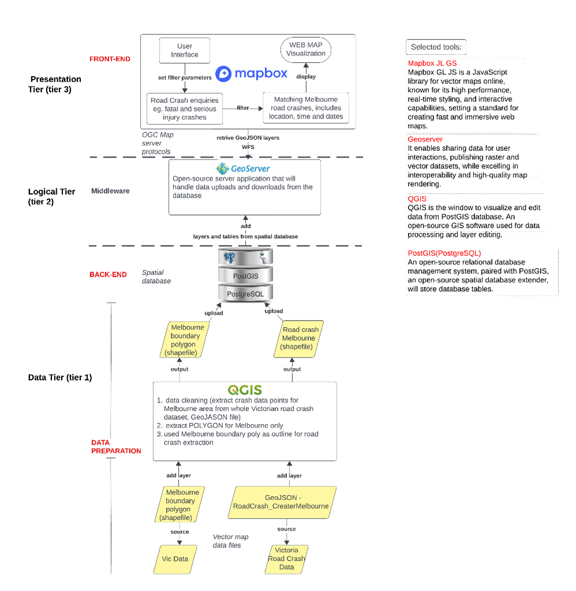

                                              **Web GIS application for Road crashes across Metropolitan Melbourne Areas**

**Aim**
To develop a cloud-based open-source web GIS application that utilize open data, open standards, and open platforms for the storage, analysis, and online presentation of spatial data.

**Objectives**
1.	To collect data from open-source repositories: (https://discover.data.vic.gov.au/dataset/victoria-road-crash-data), related to road crash in Melbourne, Victoria.
2.	To create a PostGIS geodatabase to manage spatial data using PostgreSQL and link the database into QGIS for visualization and editing.
3.	To configure a Geo-server and connect to PostGIS database, create a map styling, and publish the mapped data using WFS, enabling data interoperability. 
4.	To develop an interactive front-end web GIS application utilizing cloud-based open-source technologies like HTML and Mapbox GL JS.
5.	To publish my project to more users including the back-end database and front-end application. 

